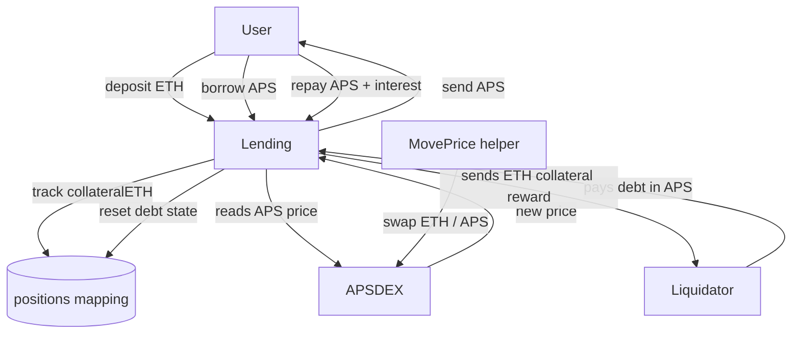

# Aave Loan Test

A Hardhat-based Solidity project that models a simple lending protocol around an APS token and an APS/ETH DEX. The protocol lets users:

- deposit ETH as collateral
- borrow APS against that collateral
- repay APS plus interest
- be liquidated when their position becomes unhealthy for long enough

The project includes unit tests for the core protocol flows and a helper contract that can move the APS/ETH price during tests.

## System Overview

The system is made of three main contracts:

- `APS.sol`: the ERC20-like token used as the borrowed asset
- `APSDEX.sol`: a simple APS/ETH liquidity pool and pricing source
- `Lending.sol`: the lending protocol that tracks collateral, debt, interest, and liquidation

There is also a helper contract used only in tests:

- `MovePrice.sol`: performs swaps against the DEX to shift the APS price and make a position liquidatable

## High-Level Flow



## Contract Architecture

### `APS.sol`

The borrowed asset. In this project it behaves like the token the borrower receives and the liquidator repays.

Important roles:

- source of the debt asset
- token that must be approved before repayment or liquidation
- token held by the lending contract as protocol liquidity

### `APSDEX.sol`

A lightweight APS/ETH pool used as the price oracle for the protocol.

Important roles:

- stores APS and ETH reserves
- exposes `currentPrice()`
- supports swaps that change the APS price
- is the pricing input for borrowing health, repayment calculations, and liquidation valuation

The lending contract uses `apsDex.currentPrice()` indirectly through `apsToETHValue()`.

### `Lending.sol`

This is the protocol core. It tracks each borrower’s position:

- `collateralETH`
- `borrowedAPS`
- `borrowTimestamp`
- `riskTimestamp`

Core behaviors:

- `addCollateral()` deposits ETH and records it against the caller
- `borrowAPS()` checks collateralization and sends APS out
- `repayLoan()` pulls back APS plus interest
- `updateRiskStatus()` marks a position as risky when health factor drops below the threshold
- `liquidate()` lets a third party repay the debt and receive collateral compensation

## Liquidation Rules

A position becomes liquidatable only when both conditions are true:

- the health factor is below `1e18`
- the position has remained risky for at least `24 hours`

That means liquidation is not immediate after a price drop. The protocol gives the borrower a grace period.

### Liquidation payment flow

When a liquidator calls `liquidate(borrower)`:

1. the liquidator pays the borrower’s outstanding APS debt plus accrued interest to the lending contract
2. the contract converts that debt to its ETH value using the current APS price
3. the contract adds the liquidation bonus
4. the liquidator receives ETH from the borrower’s collateral balance
5. the borrower’s debt is cleared

### Bonus basis

The liquidation bonus is computed from the **debt’s ETH value**, not directly from the borrower’s raw collateral.

In code:

```solidity
uint256 debtValueETH = apsToETHValue(debt);
uint256 collateralReward = (debtValueETH * (100 + LIQUIDATION_BONUS)) / 100;
```

So the bonus is based on the amount of debt being repaid, valued in ETH at the moment of liquidation.

## What Happens to Remaining Collateral?

Yes, the leftover collateral stays in the contract.

More precisely:

- `liquidate()` subtracts only the liquidator’s reward from `user.collateralETH`
- the remaining collateral is still tracked in that borrower’s position
- because `borrowedAPS` is reset to `0`, the borrower can later withdraw the remaining collateral

So the remaining ETH is not automatically “sent to treasury.” It stays inside the contract balance, but it is still associated with the borrower’s position until withdrawn.

### Important distinction

- `address(this).balance` is the contract’s total ETH balance
- it includes all collateral deposits and ETH held by the protocol
- it is **not** a dedicated treasury variable

If you want a true protocol treasury, you would need a separate accounting model or a dedicated treasury address and transfer logic. As written, the contract holds pooled ETH and keeps per-user accounting in `positions`.

## Liquidation Example

If a borrower has:

- `100 ETH` collateral
- `500 APS` debt
- a price drop that pushes the health factor below threshold
- a risky state that has lasted `24 hours`

Then a liquidator can:

- repay the debt plus interest in APS
- receive an ETH reward equal to the debt value plus the liquidation bonus
- leave any remaining collateral in the borrower’s position

## Test Coverage

The test suite currently covers:

- deployment
- collateral deposit and withdrawal
- APS borrowing
- loan repayment
- liquidation failure conditions
- successful liquidation

Run the tests with:

```bash
npx hardhat test test/lendingTest.js
```

## Project Layout

```text
contracts/
  APS.sol
  APSDEX.sol
  Lending.sol
  MovePrice.sol
  mocks/

test/
  lendingTest.js
  FlashLoanTest.js
  apsTest.sol
  lendingTest.js

scripts/
  apsDeploy.js
  flashLoanDeploy.js
  movePriceDeploy.js
```

## Development Notes

- The lending protocol uses the DEX price directly, so manipulation of the APS/ETH pool changes borrowing health and liquidation conditions.
- The liquidation path depends on accurate time progression, so the tests advance the EVM clock before attempting liquidation.
- `MovePrice.sol` exists only to simulate market movement during testing.

## Try It

```bash
npx hardhat test test/lendingTest.js
npx hardhat test
npx hardhat node
```

## Summary

This project is a compact demonstration of a collateralized lending system with:

- collateral tracking
- debt accrual
- price-dependent liquidation
- DEX-based valuation

The liquidation mechanism is intentionally simple: liquidators repay APS debt and receive ETH collateral compensation, while the borrower’s remaining collateral stays in the protocol and can be withdrawn later if their position is no longer indebted.
